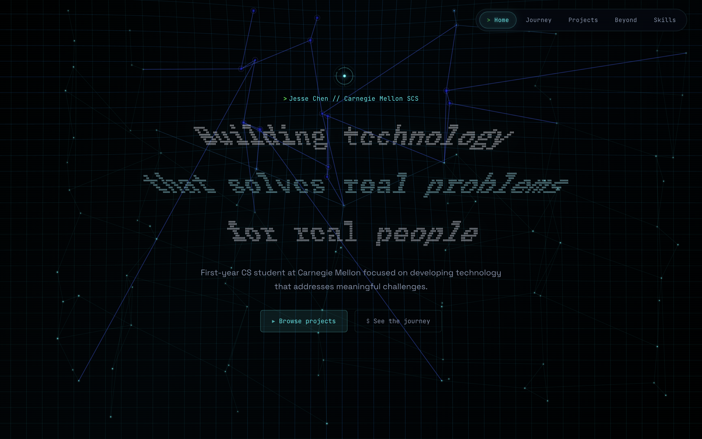
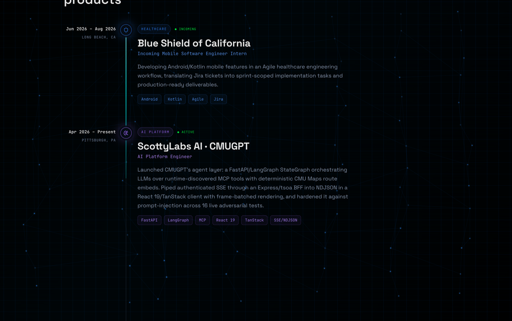
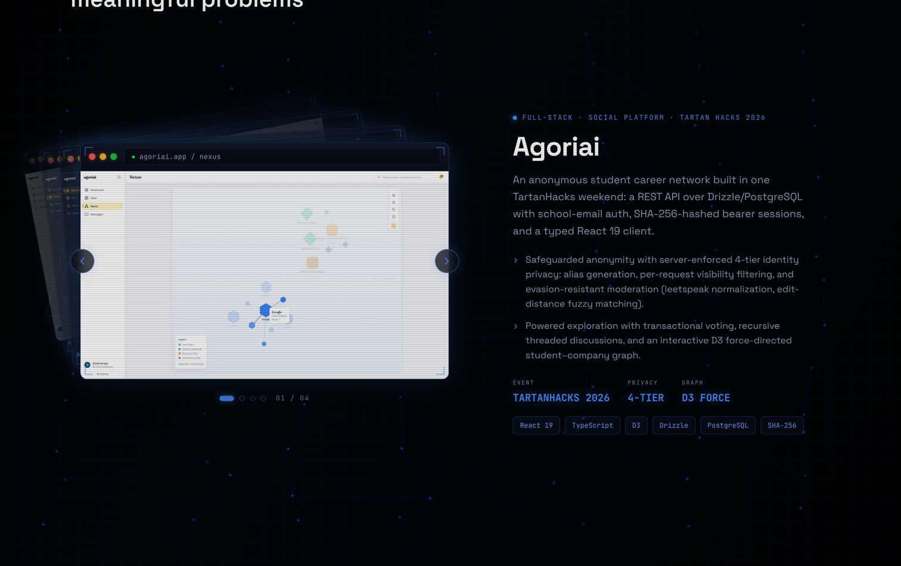
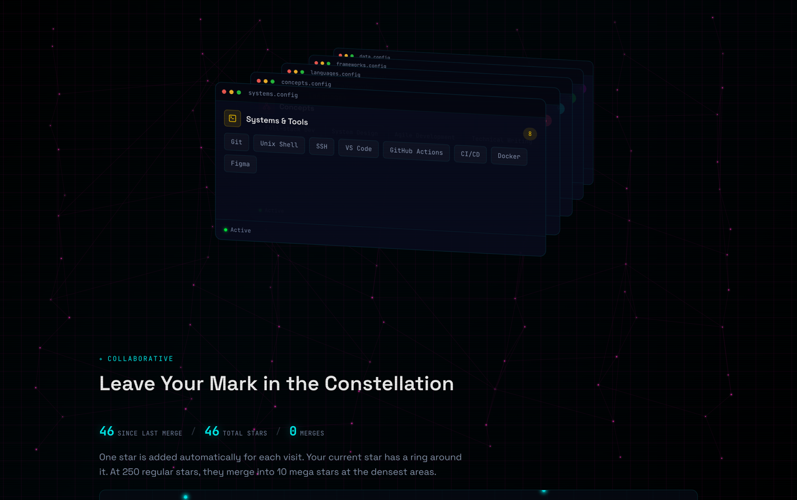
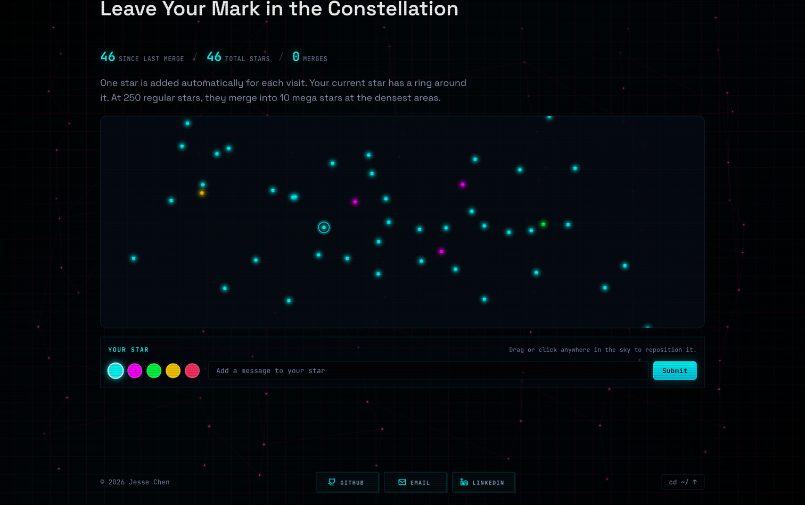
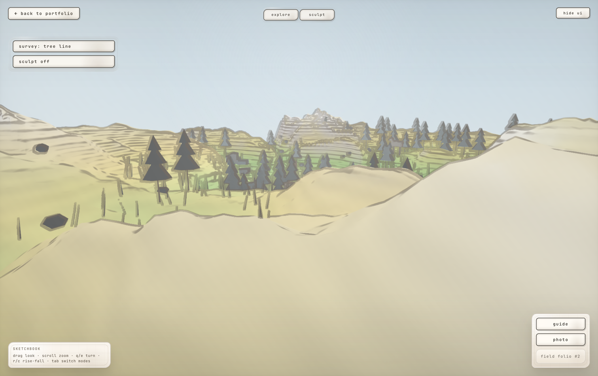

<h1>
  
</h1>

Software Engineer · Computer Science @ Carnegie Mellon University (SCS) · Machine Learning

&nbsp;&nbsp;

&nbsp;&nbsp;

 

<h2>
  
</h2>

<table width="100%">
  <tr>
    <td width="50%" valign="top"> 
<strong>The journey</strong> animated experience timeline
</td>
    <td width="50%" valign="top"> 
<strong>Selected work</strong> interactive case-study cards
</td>
  </tr>
  <tr>
    <td width="50%" valign="top"> 
<strong>The toolkit</strong> a GSAP card stack of tools
</td>
    <td width="50%" valign="top"> 
<strong>The constellation</strong> a shared, live star field
</td>
  </tr>
</table>

<h2>
  
</h2>

A secret Three.js scene with procedurally generated terrain you can sculpt and explore, rendered through a hand-drawn, pencil-on-paper post-processing pass.

<h2>
  
</h2>

<table width="100%">
  <tr>
    <th align="left" width="28%">Experience</th>
    <th align="center" width="20%">Stack</th>
    <th align="left" width="52%">What I Did</th>
  </tr>
  <tr>
    <td valign="middle"><strong>Blue Shield of California</strong> Mobile SWE Intern · 2026 to Present</td>
    <td align="center" valign="middle"></td>
    <td valign="middle">Built a differential security audit for 220+ endpoints and shipped navigation and billing redesigns for a 500K+ user Android app.</td>
  </tr>
  <tr>
    <td valign="middle"><strong>ScottyLabs AI · CMUGPT</strong> AI Platform Engineer · 2026 to Present</td>
    <td align="center" valign="middle">&nbsp;&nbsp;</td>
    <td valign="middle">Built agent orchestration, authenticated streaming, CMU Maps route embeds, and prompt-injection protections for a campus AI platform.</td>
  </tr>
  <tr>
    <td valign="middle"><strong>Sorcea Labs</strong> Mobile SWE Intern · Spring 2026</td>
    <td align="center" valign="middle"></td>
    <td valign="middle">Shipped production app flows for 10k+ users and improved home-load latency by batching network calls.</td>
  </tr>
  <tr>
    <td valign="middle"><strong>CMUMaps · ScottyLabs</strong> Data &amp; Software Engineer · 2025 to 2026</td>
    <td align="center" valign="middle">&nbsp;&nbsp;</td>
    <td valign="middle">Built geospatial ETL for all 74 CMU buildings, including OSM parsing, fuzzy matching, and interior map labels.</td>
  </tr>
  <tr>
    <td valign="middle"><strong>Coding Minds Academy</strong> Programming Instructor · 2025 to 2026</td>
    <td align="center" valign="middle"></td>
    <td valign="middle">Taught project-based CS, algorithms, debugging, and competitive programming through structured labs.</td>
  </tr>
  <tr>
    <td valign="middle"><strong>Levio</strong> Creator &amp; Developer · 2023 to 2024</td>
    <td align="center" valign="middle"></td>
    <td valign="middle">Built an offline-first Parkinson's care platform with symptom logs, medication schedules, guided therapy, and snapshot sync.</td>
  </tr>
  <tr>
    <td valign="middle"><strong>SoftCom Lab · Cal Poly Pomona</strong> Research Intern · 2023 to 2024</td>
    <td align="center" valign="middle"></td>
    <td valign="middle">Evaluated Parkinson's motor-symptom video analysis models and contributed to a peer-reviewed CCSIT publication.</td>
  </tr>
</table>

<h2>
  
</h2>

<table width="100%">
  <tr>
    <th align="left" width="24%">Project</th>
    <th align="center" width="20%">Tech Stack</th>
    <th align="left" width="56%">What It Does</th>
  </tr>
  <tr>
    <td valign="middle"><strong>Agoriai</strong></td>
    <td align="center" valign="middle"></td>
    <td valign="middle">Anonymous student career network with school-email auth, private identity tiers, threaded discussions, voting, and a student-company graph.</td>
  </tr>
  <tr>
    <td valign="middle"><strong>Levio</strong></td>
    <td align="center" valign="middle"></td>
    <td valign="middle">Offline-first Parkinson's care app for symptom tracking, medication schedules, guided therapy, crisis screening, and signed mobile releases.</td>
  </tr>
  <tr>
    <td valign="middle"><strong>Tarocchi</strong></td>
    <td align="center" valign="middle"></td>
    <td valign="middle">Interactive narrative web app with 24 branching paths, animated scene transitions, parallax, and synchronized audio.</td>
  </tr>
  <tr>
    <td valign="middle"><strong>MyCommunity</strong></td>
    <td align="center" valign="middle"></td>
    <td valign="middle">Native Android app for Boy Scouts troop discovery, real-time map markers, Google Sign-In, and a community news feed.</td>
  </tr>
</table>

<h2>
  
</h2>

<table width="100%">
  <tr>
    <th align="left" width="28%">Area</th>
    <th align="left" width="24%">Role</th>
    <th align="left" width="48%">What It Adds</th>
  </tr>
  <tr>
    <td valign="middle"><strong>Boy Scouts of America</strong></td>
    <td valign="middle">Eagle Scout</td>
    <td valign="middle">Led a 200+ hour service project, coordinated 15 volunteers, and mentored younger Scouts on planning and responsibility.</td>
  </tr>
  <tr>
    <td valign="middle"><strong>Music Performance</strong></td>
    <td valign="middle">Clarinetist &amp; Soloist</td>
    <td valign="middle">Perform with CMU's All-University Orchestra after California All-State, soloist, and Pasadena Symphony and Pops experience.</td>
  </tr>
</table>

<h2>
  
</h2>

- **Interactive canvas background:** procedurally generated node network with pointer tracking and gyroscope tilt response
- **3D sketchbook world:** a Three.js / React Three Fiber procedural terrain scene with sculpting tools and a hand-drawn post-processing pass
- **Visitor constellation:** a shared star field with read-only Firebase clients and rate-limited, ownership-checked server writes
- **Performance-adaptive:** detects device capabilities and adjusts DPR, frame rate, and rendering complexity
- **Smooth scrolling:** inertial scroll via Lenis, with code-split sections lazily loaded for fast initial paint

<h2>
  
</h2>

&nbsp;

&nbsp;

&nbsp;

&nbsp;

&nbsp;

&nbsp;

© Jesse Chen · Personal portfolio · source shared for reference

